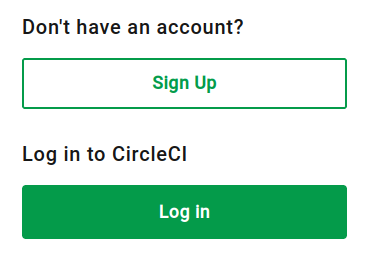

# Set up CircleCI

## Quick Links

* [`sceptre`project in CircleCI app](https://app.circleci.com/pipelines/circleci/MJpdGGmQQf5TPsL3uxpf9K/f7679d1a-fcb1-4b75-8432-01e6f138d2db)
* [Support request #143279](https://support.circleci.com/hc/requests/143279)

## Questions for Sceptre team

* How does the GitHub project authenticate to CircleCI? Does it use the GitHub OAuth app integration, or the GitHub App integration?

## Create a new project

2023-12-16.

Set up CircleCI for personal use so that I can test the CI pipelines.

I visit the CircleCI website and click "Sign Up".



I'm unsure what to choose here.


> Are you joining a team on CircleCI?
>
> * Yes, my team is already on CircleCI
> * No, I'm setting up CircleCI for my team

Sceptre is already on CircleCI. Do they want me to join their "team"?

Try "Yes".


> To join your team on CircleCI, contact a teammate and request an invite.
>
> After following the instructions in the invite, you'll be able to access and contribute to team projects.
>
> Tip: Share the link to [our invite documentation](https://circleci.com/docs/invite-your-team/) with your teammate to help them generate your invite.

Go back. Choose "Sign Up", then "No".

Start the signup process at `auth.circleci.com`.

Provide my email address and password.


Fill in the census data.


* Are you here to work on a business or personal project?: **Personal**
* What best describes your role?: **Software Engineer**
* How do you plan to use CircleCI today?: **Set up a project**
* What is the size of your engineering organization? **1 to 5 engineers**
* Does this project include AI or ML? **No**

Choose to connect to GitHub. I'll connect to my fork of the Sceptre repo.


I have a choice to install [CircleCI App](https://github.com/apps/circleci-app) into the Sceptre organization! But I'll choose my own user for now.


Install and authorize CircleCI App for the `iainelder/sceptre` repository.


Create a new project.


I need to generate a new SSH keypair. I share the public part with GitHub as a deploy key for the repo. I share the private part with CircleCI so it can clone the repo.

Use this command to generate the key. (`-N ''` means "no passphrase").

```bash
mkdir -p ~/Repos/sceptre/.ssh
ssh-keygen -t ed25519 -f ~/Repos/sceptre/.ssh/circleci -N ''
```

```text
Your identification has been saved in /home/isme/Repos/sceptre/.ssh/circleci
Your public key has been saved in /home/isme/Repos/sceptre/.ssh/circleci.pub
The key fingerprint is:
SHA256:Tnp+OakCu+sqQC+UO7Y56owCi8jH2SeMu2q46AhGMvU isme@isme-t480s
The key's randomart image is:
+--[ED25519 256]--+
|                 |
|                 |
|  o              |
| = .             |
|=.o E   S        |
|=* ..  +         |
|Xo* =o. o  o     |
|#* =.+.+  =      |
|%B==*oo.oo .     |
+----[SHA256]-----+
```

Copy the private part to the clipboard.

```bash
cat ~/Repos/sceptre/.ssh/circleci | copy
```

Paste the private part into the new project dialog.

Click "Create project".

Now I see the [pipeline view](https://app.circleci.com/pipelines/circleci/MJpdGGmQQf5TPsL3uxpf9K/XYwC8yoqjE3BjEyyGM2BfG).


Verify my email address.

Install the [CircleCI VS Code extension](https://marketplace.visualstudio.com/items?itemName=circleci.circleci).


## Authenticate to the API

2023-12-16.

In CircleCI words, a "pipeline" is an execution of a "workflow". The "workflow" is described in the `.circleci/config.yml`.

I want to trigger a pipeline without committing a change.

I can use the API to trigger a pipeline. First I need to authenticate myself.

Read CircleCI Docs for how to [Trigger a pipeline using the API](https://circleci.com/docs/triggers-overview/#run-a-pipeline-using-the-api).

Read API docs for [Trigger a new pipeline](https://circleci.com/docs/api/v2/index.html#operation/triggerPipeline).

Read [Authentication and authorization](https://circleci.com/docs/api-developers-guide/#authentication-and-authorization) in the CircleCI API docs.

In the CircleCI app click the user logo to go to the user settings menu.

CLick "Personal API Tokens".

Click "Create New Token". Name it `mytoken`.


Copy the API token and save it in 1Password.

Save the API token to `/tmp/circlecitoken` as a curl header.

```text
Circle-Token: ...
```

Test the token.

```bash
curl "https://circleci.com/api/v2/me" --header @/tmp/circlecitoken
```

CirleCI responds with my username and an ID.

```json
{
  "name" : "iain@isme.es",
  "login" : "iain@isme.es",
  "id" : "9441a5e3-1263-4975-881d-e0577a631fa0"
}
```

## Trigger a pipeline

2023-12-16.

Read CircleCI Docs for how to [Trigger a pipeline using the API](https://circleci.com/docs/triggers-overview/#run-a-pipeline-using-the-api) again.

Use this command to trigger my first pipeline.

```bash
curl -X POST 'https://circleci.com/api/v2/project/gh/iainelder/sceptre/pipeline' \
--header @/tmp/circlecitoken \
--header "content-type: application/json" \
--data '{"branch": "main"}'
```

Project not found.

```json
{
  "message" : "Project not found"
}
```

I used `main` first because that's what the CircleCI branch dropdown suggested. But that branch doesn't exist in my project.


Try again with `master` as the branch. I get the same error.

```bash
curl -X POST 'https://circleci.com/api/v2/project/gh/iainelder/sceptre/pipeline' \
--header @/tmp/circlecitoken \
--header "content-type: application/json" \
--data '{"branch": "master"}'
```

This note from the docs may explain it.

> Triggering a pipeline via the CircleCI v2 API is not currently supported for GitLab or GitHub App projects. To find out if you authorized through the GitHub OAuth app or the CircleCI GitHub App, see the GitHub App integration page.

Read [GitHub App integration overview](https://circleci.com/docs/github-apps-integration/).

I know I have authenticated my project to CircleCI with the GitHub app because of the style of the URL. This final path component is an arbitrary alphanumeric string.

```text
https://app.circleci.com/pipelines/circleci/MJpdGGmQQf5TPsL3uxpf9K
```

I can't trigger manually using the web app either.

> The ability to manually trigger a pipeline from the web app is not currently supported for GitHub App projects.

## Trigger a pipeline using an inbound webhook

2023-12-16.

The "inbound webhook" feature is the replacement feature, still in preview. A CircleCI employee announced it on [CircleCI Discuss](https://discuss.circleci.com/t/trigger-pipelines-from-anywhere-inbound-webhooks-now-in-preview/49864) on 2023-11-17.

> CircleCI customers can now trigger a pipeline from any location that can emit a webhook or run a curl request. This means you can validate changes from external tools, existing CircleCI pipelines, [changes to a model registry or dataset](https://circleci.com/blog/mlops-trigger-inbound-webhooks/), or non-commit/ non-PR code repository events, like GitHub comments.

> Check out our how-to guide below and let us know what you think. We’re always looking for feedback so feel free to add comments to this post or email our team directly at `spencer.franks@circleci.com`.

A similar how-to guide appears in the CircleCI Docs to [Trigger a pipeline from an inbound webhook](https://circleci.com/docs/triggers-overview/#trigger-a-pipeline-from-an-inbound-webhook).

Click "Project Settings" in the project view in the web app.


Click Triggers and click "Add Trigger".


Select "Inbound Webhook (Preview)" and click "Next".


The documentation offers no guidance to set "trigger source" and "trigger description". Try to leave them blank and click "Save".


Trigger source is required. Set it to `source1`.

Note the secret and the webhook URL in 1Password. Click Done.


The webhook URL is: `https://internal.circleci.com/private/soc/e/bb29a2a6-5673-403d-baef-5b46f59f7332?secret=...`.

I see `source1` in the list of project triggers. I can click the pencil to edit the trigger source and description and config file path and see the webhook URL again.


I didn't like that the secret is passed as a query string parameter. I had to [Is a HTTPS query string secure?](https://stackoverflow.com/questions/323200/is-a-https-query-string-secure) read to check the security implications.

An HTTPS connection encrypts the query string because it encrypts all parts of the HTTP request after the initial connection. the secure connection is at the transport layer, and HTTP runs on top.

Write the webhook secret in curl query parameter syntax to `/tmp/webhooksecret`.

```text
secret=...
```

Test the webhook.

```bash
curl -G "https://internal.circleci.com/private/soc/e/bb29a2a6-5673-403d-baef-5b46f59f7332" -d @/tmp/webhooksecret
```

Endpoint not found.

```bash
{"Status":"Endpoint not found"}
```

The documentation shows only how to configure something called Hugging Face. It doesn't show how to invoke the webhook with curl.

Log into the CircleCI Discuss site with GitHub.


I post a reply to the feature announcement to ask for help. Let's see if anyone responds.

## Configure the GitHub OAuth app integration

2023-11-16.

The "GitHub App" lacks features, and is caught up in AI hype, so I'll try to set up the older OAuth version which works with the API.

Try to create a new project with OAuth integration.

Go to [Projects in the web app](https://app.circleci.com/projects/organizations/circleci%2FMJpdGGmQQf5TPsL3uxpf9K/) and click "New Project".


It takes me to the same "Create New Project" dialog as before. It gives me no option to use GitHub OAuth. It shows only the GitHub App.


## Get support to trigger a pipeline

2023-12-16.

Submit a request to CircleCI support.

Their ZenDesk instance created [request #143279](https://support.circleci.com/hc/requests/143279).

> How do I trigger a new pipeline without committing?
>
> I just set up a new CircleCI project [1] for my GitHub project [2].
>
> The docs to trigger a pipeline using the API [3] is clear on how to do that for a GitHub OAuth app integration.
>
> Unfortunately when I created my project I didn't get the option to use GItHub OAuth. The "Create New Project" dialog [6] forced me to use the GitHub App integration.
>
> [3] says that the API to trigger a pipeline doesn't support a GitHub App project.
>
> The docs for the GitHub App [4] say that it's not possible to trigger a pipeline from the web app.
>
> The docs to trigger a pipeline from an inbound webhook [5] show how to configure a webhook for Hugging Face. I don't want to use Hugging Face. I want to use curl.
>
> I tried using curl like this:
>
> ```bash
> curl -G "https://internal.circleci.com/private/soc/e/bb29a2a6-5673-403d-baef-5b46f59f7332" -d @/tmp/webhooksecret
> ```
>
> I get the following error.
>
> ```json
> {"Status":"Endpoint not found"}
> ```
>
> [1]: https://app.circleci.com/pipelines/circleci/MJpdGGmQQf5TPsL3uxpf9K/f7679d1a-fcb1-4b75-8432-01e6f138d2db
> [2]: https://github.com/iainelder/sceptre
> [3]: https://circleci.com/docs/triggers-overview/#run-a-pipeline-using-the-api
> [4]: https://circleci.com/docs/github-apps-integration/
> [5]: https://circleci.com/docs/triggers-overview/#trigger-a-pipeline-from-an-inbound-webhook
> [6]: https://app.circleci.com/projects/create-project/circleci%2FMJpdGGmQQf5TPsL3uxpf9K/?return-to=https%3A%2F%2Fapp.circleci.com%2Fprojects%2Forganizations%2Fcircleci%252FMJpdGGmQQf5TPsL3uxpf9K%2F

## Trigger the pipeline using a fake commit

2023-12-16.

I give up on manual triggers. I push a new branch to see if I can get the same effect.

```bash
git switch -c fake-branch
git push -u isme fake-branch
```

In the web app I see this warning.


> sceptre 1: Orb jakousa/twitter-orb@1.0.1 not loaded. To use this orb, an organization admin must opt-in to using third party orbs in Organization Security settings.

I don't see any other evidence of activity. Did that warning block the pipeline?

My copy of the master branch is out of date. The twitter stuff already got deleted. Update the master branch.

```bash
git checkout master
git switch fake-branch
git rebase master
git push
```

Now a pipeline starts to execute. After 43 seconds the pipeline fails.


I receive an email notification of the pipeline failure.

* From: `CircleCI Builds <builds@circleci.com>`
* Subject: `[Workflow] Failed: cci-zxpjx/sceptre on fake-branch / build-test-and-deploy (bc828dc)`


## Analyze build job failure

2023-12-16.

The `build` job failed.

Click `build` to view [the step output for the build job](https://app.circleci.com/pipelines/circleci/MJpdGGmQQf5TPsL3uxpf9K/XYwC8yoqjE3BjEyyGM2BfG/2/workflows/41badc70-2141-4651-8d48-a7a033f4b452/jobs/1).

It failed at the "Checkout code" step.

```text
Using SSH Config Dir '/home/circleci/.ssh'
git version 2.42.0
Cloning git repository
Cloning into '.'...
Load key "/home/circleci/.ssh/id_rsa": error in libcrypto
git@github.com: Permission denied (publickey).
fatal: Could not read from remote repository.

Please make sure you have the correct access rights
and the repository exists.

exit status 128
```

I forgot to share the public part of the new public key with GitHub.

Add the deploy key.

```bash
gh repo deploy-key add ~/Repos/sceptre/.ssh/circleci.pub --repo iainelder/sceptre
```

```text
✓ Deploy key added to iainelder/sceptre
```

I can't just force-push to trigger the pipeline again. It says "Everything up-to-date."

```bash
git push --force
```

Delete the branch and push it again.

```bash
git switch master
git branch --delete fake-branch
git push isme --delete fake-branch
git switch -c fake-branch
git push -u isme fake-branch
```

This time nothing triggered in CircleCI.

Try a new branch name.

```bash
git switch master
git switch -c fake-2
git push -u isme fake-2
```

Nothing got triggered.

Click "Rerun workflow from start" on the "sceptre 2" pipeline.


The "sceptre 2" pipeline starts again.


The build job progresses past the "Checkout code" step.

The good output from that step looks like this:

```text
Using SSH Config Dir '/home/circleci/.ssh'
git version 2.42.0
Cloning git repository
Cloning into '.'...
remote: Enumerating objects: 7089, done.
remote: Counting objects: 100% (307/307), done.
remote: Compressing objects: 100% (180/180), done.
remote: Total 7089 (delta 172), reused 230 (delta 124), pack-reused 6782
Receiving objects: 100% (7089/7089), 1.96 MiB | 32.88 MiB/s, done.
Resolving deltas: 100% (4671/4671), done.
Checking out branch
Switched to a new branch 'fake-branch'
HEAD is now at bc828dc Remove template_path config parameter (#1386)
```
