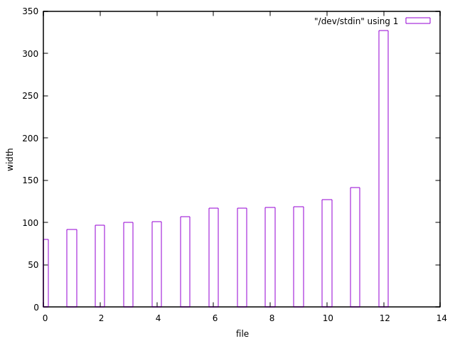

# cmd hook options

I volunteered to provide a solution for [issue 1213](https://github.com/Sceptre/sceptre/issues/1213).

See [Slack thread](https://og-aws.slack.com/archives/C01JNN8RGBB/p1689931787395429) for advice from Jon Falkenstein.

> So there are two places you should make this change, one is in the separate repo for the rcmd resolver, and the other is in the core sceptre repo for the cmd hook. I'd recommend starting in the core sceptre repo with the hook.
>
> Take a look at the cmd hook in sceptre/hooks. It defines a run method. If you evaluate self.argument, you can treat string arguments just like the current way it runs, but dict arguments can work like we've discussed.
>
> I'd recommend getting up a draft PR before you put a ton of work into it and we can discuss from there. Before we actually merge, you'll need to make sure there are unit tests and docs, but we can start discussion on effectively a prototype

## Create a basic hook setup

Clone my fork of the Sceptre repo. Install the dependencies with Poetry.

```bash
poetry install --all-extras -v
```

Start a Poetry shell.

Create a minimal project to test a hook. This hook just echos a message.

(Note: there's a bug in `put`. I wanted to read until the null byte, but as written it reads until the first `0` character. To read until the first null byte, I think I need to use `read -d ''`. I read that it's not [explicitly documented](https://unix.stackexchange.com/questions/174016/how-do-i-use-null-bytes-in-bash), but as it takes the first character of the delimiter then it becomes the null byte.)

```bash
put() {
    local path="$1"
    local input
    read -d '' input

    mkdir --parents "$(dirname "$path")"
    cat > "$path" <<< "$input"
}

tmp="$(mktemp --dir)"

put "$tmp/templates/test.yaml" <<"EOF"
Resources:
  Dummy:
    Type: AWS::CloudFormation::WaitConditionHandle
EOF

put "$tmp/config/test.yaml" <<"EOF"
template:
  type: file
  path: test.yaml
hooks:
    before_update:
        - !cmd 'echo "Hello, world!"'
EOF

put "$tmp/config/config.yaml" <<"EOF"
project_code: test
region: eu-west-1
EOF
```

Use my sandbox profile.

```console
$ .env aws-sandbox
$ use-profile
sandbox.Organization-Management-Account.480783779961.AdministratorAccess
```

Check that the project works with Sceptre.

```bash
(cd "$tmp"; sceptre launch --yes .)
```

The output shows that the hook executes.

```text
/home/isme/Repos/sceptre/sceptre/config/reader.py:145: DeprecationWarning: pkg_resources is deprecated as an API. See https://setuptools.pypa.io/en/latest/pkg_resources.html
  from pkg_resources import iter_entry_points
[2023-08-06 21:33:58] - test - Launching Stack
[2023-08-06 21:33:58] - test - Stack is in the CREATE_COMPLETE state
Hello, world!
[2023-08-06 21:33:58] - test - Updating Stack
[2023-08-06 21:33:59] - test - No updates to perform.
```

## Run pre-commit checks

I try to commit this documentation.

But pre-commit fails on black.

```console
$ pre-commit run black --all-files
[INFO] Installing environment for https://github.com/psf/black.
[INFO] Once installed this environment will be reused.
[INFO] This may take a few minutes...
An unexpected error has occurred: CalledProcessError: command: ('/home/isme/.cache/pypoetry/virtualenvs/sceptre-b3JPbPox-py3.8/bin/python', '-mvirtualenv', '/home/isme/.cache/pre-commit/repow5d0hgf1/py_env-python3.10', '-p', 'python3.10')
return code: 1
stdout:
    RuntimeError: failed to find interpreter for Builtin discover of python_spec='python3.10'

stderr: (none)
Check the log at /home/isme/.cache/pre-commit/pre-commit.log
```

For now I commit with `--no-verify` to bypass pre-commit.

The hook has a line that requires Python version 3.10.

```yaml
  - repo: https://github.com/psf/black
    rev: 23.1.0
    hooks:
      - id: black
        # It is recommended to specify the latest version of Python
        # supported by your project here, or alternatively use
        # pre-commit's default_language_version, see
        # https://pre-commit.com/#top_level-default_language_version
        language_version: python3.10
```

When I comment out the line, the hook works.

```console
$ pre-commit run black --all-files
[INFO] Installing environment for https://github.com/psf/black.
[INFO] Once installed this environment will be reused.
[INFO] This may take a few minutes...
black....................................................................Passed
```

I thought that pre-commit ran hooks in Docker containers, but that must be wrong. It apparently uses a virtual environment for Python hooks.

I find the same problem with black reported in [the pre-commit project](https://github.com/pre-commit/pre-commit/issues/1761).

Anthony Sottile, the pre-commit maintainer, also uses Ubuntu and maintains the deadsnakes PPA for Python packages.

Use [the deadsnakes PPA](https://launchpad.net/~deadsnakes/+archive/ubuntu/ppa) to install a version of Python 3.10.

```bash
sudo add-apt-repository ppa:deadsnakes/ppa
sudo apt update
sudo apt install python3.10
```

Now restore the `language_version` line in the hook and try again.

The hook works as expected.

## Read the contributing guide

The [contributing guide](https://github.com/Sceptre/sceptre/blob/master/CONTRIBUTING.md) shows pre-commit and tox and various other tasks I should take care of as a developer.

## Run unit tests with tox

```bash
poetry run tox
```

To pass all the unit tests I need to install all the supported Python versions. Python 3.10 was already installed for black.

```bash
sudo apt install python3.7 python3.9 python3.11
```

Tox still fails on Python 3.7 because of a missing dependency.

```bash
poetry run tox -e py37
```

```console
ModuleNotFoundError: No module named 'distutils.cmd'
```

[Ask Ubuntu](https://askubuntu.com/a/1296996/143624) gives a solution to this exact problem. Install the missing distutils package from deadsnakes.

```bash
sudo apt install python3.7-distutils
```

Now the tests pass on Python 3.7.

```text
  py37: commands succeeded
```

## Ask question about version difference between black and tox

See [GitHub issue 1370](https://github.com/Sceptre/sceptre/issues/1370).

## Read code for cmd hook

The cmd hook appears to be implemented at `sceptre/hooks/cmd.py`. It's short.

The `Cmd` class is basically a wrapper for [`subprocess.check_call`](https://docs.python.org/3/library/subprocess.html#subprocess.check_call).

> Run command with arguments. Wait for command to complete. If the return code was zero then return, otherwise raise CalledProcessError.

The `run` method take no arguments, so the command string must be handled in the initializer.

`__init__` just delegates to the superclass `Hook`.

`Hook` has no `__init__` method.

`Hook`'s superclass is `CustomYamlTagBase`.

`CustomYamlTagBase`'s docstring starts:

> A base class for custom Yaml Elements (i.e. hooks and resolvers).

`CustomYamlTagBase`'s `__init__` method takes two keyword arguments `argument` and `stack`. It assigns `argument` to `self._argument` and assigns `stack` to `self.stack`. The class defines an `argument` property that either just returns `self._argument` or calls `self._resolve_argument`.

`Cmd`'s `run` method passes `self.argument` to `check_call`.

`Cmd.run` also passes environment variables to `check_call` after retrieving them from `self.stack.connection_manager.create_session_environment_variables()`.

The `asg_scaling_processes` hook also takes a string argument.

Review Jon Falkenstein's notes in the issue about a possible solution. Now it makes more sense!

> the `cmd` hook simply executes `subprocess.check_call(self.argument, shell=True)`
>
> I can imagine a way for that hook to evaluate `self.argument` and decide:
>
> * If `self.argument` is a `str`, it would execute the command just like it does now
>
> * If `self.argument` is a dict, it would let you specify subprocess kwargs, like:
>   ```yaml
>       before_update:
>           - !cmd
>               args: "echo I'm using bash!"
>               executable: "/bin/bash"
>   ```

Next steps:

* Write a hook with dict args to see how it behaves (should fail)
* Attempt to modify the hook to handle `args` and `executable` arguments
* Put up a draft PR for discussion with Sceptre dev team

## Write a hook with dict args

There is already a lot of test material in the tests folder. I'll ignore it for now and set up just what I need for a proof of concept.

I will trim all the deprecation warnings and full stack traces from the outputs except when relevant.

Add args to the hook.

```bash
put "$tmp/config/test.yaml" <<"EOF"
template:
  type: file
  path: test.yaml
hooks:
    before_update:
        - !cmd
            args: 'echo $0'
            executable: "bash"
EOF
```

See how Sceptre behaves. Number the output lines for easier referencing.

```bash
(cd "$tmp"; sceptre launch --yes .) 2>&1 | cat -n
```

```text
     3	[2023-08-17 19:33:50] - test - Launching Stack
     4	[2023-08-17 19:33:50] - test - Stack is in the CREATE_COMPLETE state
     5	executable: 1: args: not found
     6	Traceback (most recent call last):
    57	subprocess.CalledProcessError: Command '{'args': 'echo "Hello, world!"', 'executable': '/bin/bash'}' returned non-zero exit status 127.
```

Line 5 is the shell output from the hook command.

Line 57 is the Python error that halts Sceptre.

It's unclear exactly what is being sent to the shell for execution.

The shell is `/bin/sh`, which on my system is `/bin/dash`.

Line 57 suggests it is a line like this (input escaped for `bash` before passing to `dash`):

```console
$ /bin/sh -c "{'args': 'echo \"Hello, world\!\"', 'executable': '/bin/bash'}"
/bin/sh: 1: {args:: not found
```

The output has the `1: ` and the `: not found` parts. That looks like a line number and an error message from dash. But the other parts, my input, the interpreter name and the command, are different.

This invocation gives the same error message on line 5.

```console
$ /bin/sh -c 'args' executable
executable: 1: args: not found
```

Check the Cmd hook code.

The object is just passed to `check_call`, so Sceptre does whatever it does.

```python
subprocess.check_call(self.argument, shell=True, env=envs)
```

Execute the same in a Python shell.

```python
import subprocess
subprocess.check_call({'args': 'echo \"Hello, world\!\"', 'executable': '/bin/bash'}, shell=True)
```

I get the same output from dash and the same Python exception.

(Also I get a strange error from requests. What's it doing here!?)

```text
executable: 1: args: not found
/usr/lib/python3/dist-packages/requests/__init__.py:89: RequestsDependencyWarning: urllib3 (1.26.16) or chardet (3.0.4) doesn't match a supported version!
  warnings.warn("urllib3 ({}) or chardet ({}) doesn't match a supported "
Traceback (most recent call last):
  File "<stdin>", line 1, in <module>
  File "/usr/lib/python3.8/subprocess.py", line 364, in check_call
    raise CalledProcessError(retcode, cmd)
subprocess.CalledProcessError: Command '{'args': 'echo "Hello, world\\!"', 'executable': '/bin/bash'}' returned non-zero exit status 127.
```

If I pass a simple string I get the output from the command and then the return value of the `check_call` function, which is the exit code of dash.

```python
subprocess.check_call('echo "Hello, world!"', shell=True)
```

```text
Hello, world!
0
```

Try to make the same calls using the Cmd hook interface.

It depends on Stack, which depends on a stack config (not sure about the type here but `dict` seems to work) and on valid session credentials (discover that by running without a default profile and get `sceptre.exceptions.InvalidAWSCredentialsError: Session credentials were not found. Profile: None. Region: region1.` or by running with an expired session and getting `botocore.exceptions.UnauthorizedSSOTokenError: The SSO session associated with this profile has expired or is otherwise invalid. To refresh this SSO session run aws sso login with the corresponding profile.`).

Minimal setup to run the hook in Python.

```python
from sceptre.hooks.cmd import Cmd
from sceptre.stack import Stack
stack = Stack("stack1", "project1", "region1", template_handler_config={"template": "path.yaml"})
cmd = Cmd("echo 'Hello, world!'", stack)
cmd.run()
```

```text
Hello, world!
```

---

Try to use a shell other than `/bin/sh` via `check_call`.

`check_call` delegates to [`Popen`](https://docs.python.org/3/library/subprocess.html#subprocess.Popen).

> On POSIX with `shell=True`, the shell defaults to `/bin/sh.`

>  If `shell=True`, on POSIX the _executable_ argument specifies a replacement shell for the default `/bin/sh`.

`check_call`'s signature includes `**other_popen_kwargs`. It supports the `executable` argument directly.

```python
subprocess.check_call('echo "Hello, world!"', shell=True, executable='/bin/bash')
```

```text
Hello, world!
0
```

In this way I can use the `[[` syntax that prompted the GitHub issue.

```python
subprocess.check_call('if [[ 1 > 0 ]]; then echo "Hello"; fi', shell=True, executable='/bin/bash')
```

```text
Hello
0
```

Without setting executable, I get the same error from `/bin/sh`. The return code is still 0, though.

```python
subprocess.check_call('if [[ 1 > 0 ]]; then echo "Hello"; fi', shell=True)
```

```text
/bin/sh: 1: [[: not found
0
```

What if I want to set arguments to the shell executable? This doesn't work.

```python
subprocess.check_call('if [[ 1 > 0 ]]; then echo "Hello"; fi', shell=True, executable="/bin/sh -e")
```

```text
Traceback (most recent call last):
  File "<stdin>", line 1, in <module>
  File "/usr/lib/python3.8/subprocess.py", line 359, in check_call
    retcode = call(*popenargs, **kwargs)
  File "/usr/lib/python3.8/subprocess.py", line 340, in call
    with Popen(*popenargs, **kwargs) as p:
  File "/usr/lib/python3.8/subprocess.py", line 858, in __init__
    self._execute_child(args, executable, preexec_fn, close_fds,
  File "/usr/lib/python3.8/subprocess.py", line 1704, in _execute_child
    raise child_exception_type(errno_num, err_msg, err_filename)
FileNotFoundError: [Errno 2] No such file or directory: '/bin/sh -e'
```

In this case it looks like the easier thing to do is just ignore shell mode and build the command string directly. See this [Stack Overflow](https://stackoverflow.com/a/15782232/111424) answer for inspiration.

```python
shell = "bash -e"
cmd = 'echo "Hello, world!"'
args = shlex.split(shell) + ["-c", cmd]
subprocess.check_call(args)
```

I'm not sure whether it's okay to hard-code the `"-c"` part. It's part of `sh`'s [POSIX standard](https://pubs.opengroup.org/onlinepubs/9699919799/utilities/V3_chap02.html), so maybe it is.

---

Now I'm ready to implement the new version.

Rewrite the Cmd hook to handle the dict parameters. The call becomes:

```python
subprocess.check_call(
    self.argument["args"],
    shell=True,
    env=envs,
    executable=self.argument["executable"]
)
```

When I run sceptre with the new parameters in the hook YAML, it works.

```text
     3	[2023-08-27 17:46:07] - test - Launching Stack
     4	[2023-08-27 17:46:09] - test - Stack is in the CREATE_COMPLETE state
     5	Hello, world!
     6	[2023-08-27 17:46:09] - test - Updating Stack
     7	[2023-08-27 17:46:09] - test - No updates to perform.
```

Add another stack config that uses the original syntax.

```bash
put "$tmp/config/test2.yaml" <<"EOF"
template:
  type: file
  path: test.yaml
hooks:
    before_update:
        - !cmd 'echo "Hello, world!"'
EOF
```

The two configs are now side-by-side.

```bash
tree "$tmp"
```

```text
/tmp/tmp.XXT21f8f4F
├── config
│   ├── config.yaml
│   ├── test2.yaml
│   └── test.yaml
└── templates
    └── test.yaml
```

test2 does create on the first launch because the hook triggers only before update.

On the second launch, I get an error:

```text
     3	[2023-08-27 18:14:16] - test - Launching Stack
     4	[2023-08-27 18:14:16] - test2 - Launching Stack
     5	[2023-08-27 18:14:17] - test - Stack is in the CREATE_COMPLETE state
     6	Hello, world!
     7	[2023-08-27 18:14:17] - test2 - Stack is in the CREATE_COMPLETE state
     8	[2023-08-27 18:14:17] - test - Updating Stack
     9	[2023-08-27 18:14:17] - test - No updates to perform.
    10	"The argument \"echo \"Hello, world!\"\" is the wrong type - cmd hooks require arguments of type string."
```

I expected it to fail, but the error message doesn't make much sense.

InvalidHookArgumentTypeError is a SceptreException. Sceptre appears to just print the message instead of the whole stack trace for this exception type.

Definition in `sceptre/exceptions.py`:

```python
class InvalidHookArgumentTypeError(SceptreException):
    """
    Error raised if a hook's argument type is invalid.
    """

    pass
```

If I comment out the original code and just raise the TypeError, what happens?

```python
try:
    ...
except TypeError:
    # raise InvalidHookArgumentTypeError(
    #     'The argument "{0}" is the wrong type - cmd hooks require '
    #     "arguments of type string.".format(self.argument)
    # )
    raise
```

I get a traceback:

```text
    10	Traceback (most recent call last):
    ...
    59	TypeError: string indices must be integers
```

The special handling for SceptreException is in `cli/helpers.py`. The `catch_exceptions` function returns its input function wrapped in an error handler. It catches `SceptreException`, `BotoCoreError`, `ClientError`, `Boto3Error`, and `TemplateError`. It calls `write` on the error (I suppose this is what prints out the exception message) and then calls `sys.exit(1)`. So all of these errors are fatal errors in the Sceptre CLI. I don't know how the other types are defined. I can look them up later.

If I add this part before the try-catch:

```python
if isinstance(self.argument, str):
     args = self.argument
     executable = None
elif isinstance(self.argument, dict):
     args = self.argument["args"]
     executable = self.argument["executable"]
```

And use this subprocess call:

```python
subprocess.check_call(args, shell=True, env=envs, executable=executable)
```

Then the hook handles both input types.

```text
     3	[2023-08-27 18:43:03] - test - Launching Stack
     4	[2023-08-27 18:43:03] - test2 - Launching Stack
     5	[2023-08-27 18:43:03] - test - Stack is in the CREATE_COMPLETE state
     6	Hello, world!
     7	[2023-08-27 18:43:03] - test - Updating Stack
     8	[2023-08-27 18:43:03] - test2 - Stack is in the CREATE_COMPLETE state
     9	Hello, world!
    10	[2023-08-27 18:43:03] - test2 - Updating Stack
    11	[2023-08-27 18:43:04] - test2 - No updates to perform.
    12	[2023-08-27 18:43:04] - test - No updates to perform.
```

In which circumstances would a type error be raised? Maybe if the `!cmd` directive took an int or a list.

I'll share this proof of concept with the other developers before diving deeper into error handling.

One more test: does it support a hook with Bash syntax?

```bash
put "$tmp/config/test3.yaml" <<"EOF"
template:
  type: file
  path: test.yaml
hooks:
    before_update:
        - !cmd
            args: 'if [[ true ]]; then echo "Supports Bash syntax."; else "Not Bash? Impossible!"; fi'
            executable: '/bin/bash'
EOF
```

Yes, it supports Bash syntax.

```text
     2	  from pkg_resources import iter_entry_points
     3	[2023-08-27 19:41:46] - test - Launching Stack
     4	[2023-08-27 19:41:46] - test3 - Launching Stack
     5	[2023-08-27 19:41:46] - test2 - Launching Stack
     6	[2023-08-27 19:41:47] - test - Stack is in the CREATE_COMPLETE state
     7	Hello, world!
     8	[2023-08-27 19:41:47] - test3 - Stack is in the CREATE_COMPLETE state
     9	[2023-08-27 19:41:47] - test - Updating Stack
    10	Supports Bash syntax.
    11	[2023-08-27 19:41:47] - test3 - Updating Stack
    12	[2023-08-27 19:41:47] - test2 - Stack is in the CREATE_COMPLETE state
    13	Hello, world!
    14	[2023-08-27 19:41:47] - test2 - Updating Stack
    15	[2023-08-27 19:41:47] - test2 - No updates to perform.
    16	[2023-08-27 19:41:47] - test - No updates to perform.
    17	[2023-08-27 19:41:47] - test3 - No updates to perform.
```

## Prepare draft PR

Now I prepare the draft PR to get feedback from the other developers.

Split out the dev notes to a new repo. They are just noise in the PR.

Create a new repo for the dev notes.

```bash
git clone https://github.com/iainelder/sceptre sceptre-dev-notes
cd sceptre-dev-notes/
git filter-repo --path dev-notes
```

```text
Parsed 1043 commits
New history written in 0.12 seconds; now repacking/cleaning...
Repacking your repo and cleaning out old unneeded objects
Enumerating objects: 37, done.
Counting objects: 100% (37/37), done.
Delta compression using up to 8 threads
Compressing objects: 100% (10/10), done.
Writing objects: 100% (37/37), done.
Total 37 (delta 8), reused 18 (delta 8), pack-reused 0
Completely finished after 0.19 seconds.
```

```bash
tree
```

```text
.
└── dev-notes
    └── cmd-hook-options.md

1 directory, 1 file
```

```bash
git branch -M main
git remote add origin https://github.com/iainelder/sceptre-dev-notes.git
git push -u origin main
```

Delete my fork, create a new one, and recreate the changes to the hook.

PR message:

---

My first attempt at adding the executable config to the cmd hook.

The aim is to provide a solution for #1213.

I share this draft as a proof of concept to get feedback on the basic idea.

It will need unit tests and some new error handling and perhaps more changes before it is ready.

---

## Fix the unit tests

If I run tox or pytest I see there are unit test failures.

After running pytest once, use `pytest --lf` to rerun just the failed tests.

```bash
pytest --lf
```

```text
Test session starts (platform: linux, Python 3.8.10, pytest 6.2.5, pytest-sugar 0.9.7)
rootdir: /home/isme/Repos/sceptre
plugins: requests-mock-1.11.0, cov-2.12.1, sugar-0.9.7
collected 637 items / 635 deselected / 2 selected                                    
run-last-failure: rerun previous 2 failures


――――――――――――――――――――――― TestCmd.test_run_with_non_str_argument ―――――――――――――――――――――――

self = <tests.test_hooks.test_cmd.TestCmd object at 0x7f00930dde50>

    def test_run_with_non_str_argument(self):
        self.cmd.argument = None
        with pytest.raises(InvalidHookArgumentTypeError):
>           self.cmd.run()

tests/test_hooks/test_cmd.py:21: 
_ _ _ _ _ _ _ _ _ _ _ _ _ _ _ _ _ _ _ _ _ _ _ _ _ _ _ _ _ _ _ _ _ _ _ _ _ _ _ _ _ _ _ 

self = !Cmd

    def run(self):
        """
        Runs the argument string in a subprocess.
    
        :raises: sceptre.exceptions.InvalidTaskArgumentTypeException
        :raises: subprocess.CalledProcessError
        """
        envs = self.stack.connection_manager.create_session_environment_variables()
    
        if isinstance(self.argument, str):
            args = self.argument
            executable = None
        elif isinstance(self.argument, dict):
            args = self.argument["args"]
            executable = self.argument["executable"]
    
        try:
>           subprocess.check_call(args, shell=True, env=envs, executable=executable)
E           UnboundLocalError: local variable 'args' referenced before assignment

sceptre/hooks/cmd.py:31: UnboundLocalError

 tests/test_hooks/test_cmd.py ⨯                                         50% █████     

――――――――――――――――――――――――― TestCmd.test_run_with_str_argument ―――――――――――――――――――――――――

self = <tests.test_hooks.test_cmd.TestCmd object at 0x7f0092f90eb0>
mock_call = <MagicMock name='check_call' id='139640442540864'>

    @patch("sceptre.hooks.cmd.subprocess.check_call")
    def test_run_with_str_argument(self, mock_call):
        self.cmd.argument = "echo hello"
        self.cmd.run()
        expected_envs = (
            self.stack.connection_manager.create_session_environment_variables.return_value
        )
>       mock_call.assert_called_once_with("echo hello", shell=True, env=expected_envs)

tests/test_hooks/test_cmd.py:30: 
_ _ _ _ _ _ _ _ _ _ _ _ _ _ _ _ _ _ _ _ _ _ _ _ _ _ _ _ _ _ _ _ _ _ _ _ _ _ _ _ _ _ _ 
/usr/lib/python3.8/unittest/mock.py:925: in assert_called_once_with
    return self.assert_called_with(*args, **kwargs)
_ _ _ _ _ _ _ _ _ _ _ _ _ _ _ _ _ _ _ _ _ _ _ _ _ _ _ _ _ _ _ _ _ _ _ _ _ _ _ _ _ _ _ 

self = <MagicMock name='check_call' id='139640442540864'>, args = ('echo hello',)
kwargs = {'env': <Mock name='mock.connection_manager.create_session_environment_variables()' id='139640442395184'>, 'shell': True}
expected = (('echo hello',), {'env': <Mock name='mock.connection_manager.create_session_environment_variables()' id='139640442395184'>, 'shell': True})
actual = call('echo hello', shell=True, env=<Mock name='mock.connection_manager.create_session_environment_variables()' id='139640442395184'>, executable=None)
_error_message = <function NonCallableMock.assert_called_with.<locals>._error_message at 0x7f009479e940>
cause = None

    def assert_called_with(self, /, *args, **kwargs):
        """assert that the last call was made with the specified arguments.
    
        Raises an AssertionError if the args and keyword args passed in are
        different to the last call to the mock."""
        if self.call_args is None:
            expected = self._format_mock_call_signature(args, kwargs)
            actual = 'not called.'
            error_message = ('expected call not found.\nExpected: %s\nActual: %s'
                    % (expected, actual))
            raise AssertionError(error_message)
    
        def _error_message():
            msg = self._format_mock_failure_message(args, kwargs)
            return msg
        expected = self._call_matcher((args, kwargs))
        actual = self._call_matcher(self.call_args)
        if expected != actual:
            cause = expected if isinstance(expected, Exception) else None
>           raise AssertionError(_error_message()) from cause
E           AssertionError: expected call not found.
E           Expected: check_call('echo hello', shell=True, env=<Mock name='mock.connection_manager.create_session_environment_variables()' id='139640442395184'>)
E           Actual: check_call('echo hello', shell=True, env=<Mock name='mock.connection_manager.create_session_environment_variables()' id='139640442395184'>, executable=None)

/usr/lib/python3.8/unittest/mock.py:913: AssertionError

 tests/test_hooks/test_cmd.py ⨯                                        100% ██████████
============================== short test summary info ===============================
FAILED tests/test_hooks/test_cmd.py::TestCmd::test_run_with_non_str_argument - Unbo...
FAILED tests/test_hooks/test_cmd.py::TestCmd::test_run_with_str_argument - Assertio...

Results (1.11s):
       2 failed
         - tests/test_hooks/test_cmd.py:18 TestCmd.test_run_with_non_str_argument
         - tests/test_hooks/test_cmd.py:23 TestCmd.test_run_with_str_argument
     635 deselected
```

Fix `test_run_with_non_str_argument` by handling null input.

## Rewrite the unit tests to test behavior, not implementation

Subprocess testing resources:

* `fake_process` from [pytest-subprocess](https://pytest-subprocess.readthedocs.io/en/latest/usage.html )
* `MockPopen` from [testfixtures](https://testfixtures.readthedocs.io/en/latest/popen.html)
* `spy` from [pytest-mock](https://pytest-mock.readthedocs.io/en/latest/usage.html)
* `capfd` from [PyTest documentation](https://docs.pytest.org/en/7.1.x/how-to/capture-stdout-stderr.html)
* `capfd` useful example from [scivision.dev](https://www.scivision.dev/pytest-stderr-capture/)
* https://pythonhosted.org/MockProc/
* `ptracer` from [Pintrest](https://ptracer.readthedocs.io/en/latest/) - system call tracing in Python programs
* https://python-ptrace.readthedocs.io/en/latest/ (see also similar projects) - python-ptrace is a debugger. No longer maintained.

I rewrite the tests to test the behavior instead of the implementation.

I removed all the subprocess mocking so that it uses real subprocesses. I use an `echo` command so that it is easy to check the standard output via `capfd`.

The old mocked of stack also mocked the connection manager. Now the real connection manager causes the tests to fail unless I have a valid session to an AWS account. Is that acceptable in the unit tests? If not, find another way around that. Moto? Another way to mock the connection manager?

https://copyprogramming.com/howto/mocking-subproces-calls-in-python

I don't know how to test the `executable` parameter of the hook without resorting to mocks. I've posted a [question on Stack Overflow](https://stackoverflow.com/questions/77005909/how-do-i-test-that-a-given-shell-has-been-executed-in-python) for guidance.

I got a simple solution to the problem: `echo $0`. See my own answer for details.

I've replaced the old tests with new ones that cover all the cases I can think of.

## Add examples to the documentation

Read the [live documentation](https://docs.sceptre-project.org/latest/docs/hooks.html) for the `cmd` hook.

Find the source code in the sceptre repo. (Trim results from the `.tox` directory.)

```
$ find -name 'hooks.*'
./docs/_source/docs/hooks.rst
```

The documentation uses ReStructuredText syntax.

How do I build the HTML from the documentation source?

There is a Makefile in the docs directory.

Start the `poetry shell` in docs.

I get an error about a missing executable.

```console
$ make
/bin/sh: 1: sphinx-build: not found
make: *** [Makefile:12: help] Error 127
```

The Poetry project extras were missing. Fix that with the command from the CONTRIBUTING guide.

```bash
poetry install --all-extras -v
```

Now make runs Sphinx and shows the available actions.

```console
$ make
Sphinx v5.1.1
Please use `make target' where target is one of
  html        to make standalone HTML files
  dirhtml     to make HTML files named index.html in directories
  singlehtml  to make a single large HTML file
  pickle      to make pickle files
  json        to make JSON files
  htmlhelp    to make HTML files and an HTML help project
  qthelp      to make HTML files and a qthelp project
  devhelp     to make HTML files and a Devhelp project
  epub        to make an epub
  latex       to make LaTeX files, you can set PAPER=a4 or PAPER=letter
  latexpdf    to make LaTeX and PDF files (default pdflatex)
  latexpdfja  to make LaTeX files and run them through platex/dvipdfmx
  text        to make text files
  man         to make manual pages
  texinfo     to make Texinfo files
  info        to make Texinfo files and run them through makeinfo
  gettext     to make PO message catalogs
  changes     to make an overview of all changed/added/deprecated items
  xml         to make Docutils-native XML files
  pseudoxml   to make pseudoxml-XML files for display purposes
  linkcheck   to check all external links for integrity
  doctest     to run all doctests embedded in the documentation (if enabled)
  coverage    to run coverage check of the documentation (if enabled)
  clean       to remove everything in the build directory
```

There's nothing in the CONTRIBUTING guide about Sphinx or make.

The targets in the help don't match what I see in the Makefile: `help`, `apidoc`, `clean`. I don't understand the Makefile format.

Use project-local `.ackrc` to ignore places I don't want to search.

```text
--ignore-dir=.tox
--ignore-file=is:poetry.lock
```

Sphinx appears here:

```console
$ ack -i -l sphinx
docs/docs_requirements.txt
docs/_source/docs/install.rst
docs/_source/conf.py
docs/Makefile
CHANGELOG.md
pyproject.toml
.gitignore
.circleci/github-pages.sh
Makefile
```

The bigger Makefile at the root also doesn't correspond to what I see.

```console
$ make html
make: *** No rule to make target 'html'.  Stop.
```

John Falkenstein [told me to use](https://og-aws.slack.com/archives/C01JNN8RGBB/p1693660241455129) `make docs`.

It works! When the process completes, it opens a tab in Firefox at the following address:

```text
file:///home/isme/Repos/sceptre/docs/_build/html/index.html
```

The hooks file is here:

```text
file:///home/isme/Repos/sceptre/docs/_build/html/docs/hooks.html
```

Complete output from the process:

```text
rm -f docs/modules.rst
poetry run sphinx-apidoc -o docs/ sceptre
Creating file docs/sceptre.rst.
Creating file docs/sceptre.cli.rst.
Creating file docs/sceptre.config.rst.
Creating file docs/sceptre.diffing.rst.
Creating file docs/sceptre.hooks.rst.
Creating file docs/sceptre.plan.rst.
Creating file docs/sceptre.resolvers.rst.
Creating file docs/sceptre.template_handlers.rst.
Creating file docs/modules.rst.
make -C docs clean
make[1]: Entering directory '/home/isme/Repos/sceptre/docs'
rm -f sceptre*rst
rm -f modules.rst
rm -rf _build
make[1]: Leaving directory '/home/isme/Repos/sceptre/docs'
make -C docs html
make[1]: Entering directory '/home/isme/Repos/sceptre/docs'
Running Sphinx v5.1.1
making output directory... done
loading intersphinx inventory from https://docs.python.org/3/objects.inv...
loading intersphinx inventory from https://boto3.amazonaws.com/v1/documentation/api/latest/objects.inv...
loading intersphinx inventory from https://zepworks.com/deepdiff/current/objects.inv...
building [mo]: targets for 0 po files that are out of date
building [html]: targets for 23 source files that are out of date
updating environment: [new config] 23 added, 0 changed, 0 removed
reading sources... [100%] index                                                       
sceptre launch:1: ERROR: Unexpected indentation.
looking for now-outdated files... none found
pickling environment... done
checking consistency... done
preparing documents... done
writing output... [100%] index                                                        
/home/isme/Repos/sceptre/docs/_source/docs/stack_config.rst:132: WARNING: Could not lex literal_block as "yaml". Highlighting skipped.
/home/isme/Repos/sceptre/docs/_source/docs/stack_config.rst:564: WARNING: Could not lex literal_block as "yaml". Highlighting skipped.
generating indices... genindex py-modindex done
highlighting module code... [100%] sceptre.template                                   
writing additional pages... search done
copying static files... done
copying extra files... done
dumping search index in English (code: en)... done
dumping object inventory... done
build succeeded, 3 warnings.

The HTML pages are in _build/html.
make[1]: Leaving directory '/home/isme/Repos/sceptre/docs'
python -c "$BROWSER_PYSCRIPT" docs/_build/html/index.html
```

These lines appear in red and look like errors or warnings. I'll fix them later.

```text
sceptre launch:1: ERROR: Unexpected indentation.
/home/isme/Repos/sceptre/docs/_source/docs/stack_config.rst:132: WARNING: Could not lex literal_block as "yaml". Highlighting skipped.
/home/isme/Repos/sceptre/docs/_source/docs/stack_config.rst:564: WARNING: Could not lex literal_block as "yaml". Highlighting skipped.
```

Copy important details from the [`subprocess` module's documentation](https://docs.python.org/3/library/subprocess.html).

Where is the right margin for the documentation source?

Use gnuplot to draw the sorted line lengths.

```bash
find docs/_source/docs -name '*.rst' -exec wc -L {} + \
| grep -v " total$" \
| awk '{print $1}' \
| sort -n \
| tee /dev/tty \
| gnuplot -p -e '
set xlabel "file";
set ylabel "width";
set xrange [0:];
set yrange [0:];
plot "/dev/stdin" using 1 with histograms
'
```



Sorted line lengths:

```text
80
92
97
100
101
107
117
117
118
119
127
141
327
```

I don't really know what I'm doing yet with Gnuplot. It's a complex tool with a whole language to describe graphics. I figured out a basic thing from [Stack Overflow](https://stackoverflow.com/questions/2471884/histogram-using-gnuplot) and the [Gnuplot Surprising](http://gnuplot-surprising.blogspot.com/2011/09/statistic-analysis-and-histogram.html) blog.

Remy van Elst's [gnuplot walkthrough](https://raymii.org/s/tutorials/GNUplot_tips_for_nice_looking_charts_from_a_CSV_file.html) looks like a good way to learn more about it.

```bash
find docs/_source/docs -name '*.rst' -exec wc -L {} + | sort -n
```

Just show the margin for each file.

```text
    80 docs/_source/docs/terminology.rst
    92 docs/_source/docs/cli.rst
    97 docs/_source/docs/architecture.rst
   100 docs/_source/docs/install.rst
   101 docs/_source/docs/get_started.rst
   107 docs/_source/docs/hooks.rst
   117 docs/_source/docs/permissions.rst
   117 docs/_source/docs/resolvers.rst
   118 docs/_source/docs/template_handlers.rst
   119 docs/_source/docs/faq.rst
   127 docs/_source/docs/stack_config.rst
   141 docs/_source/docs/stack_group_config.rst
   327 docs/_source/docs/templates.rst
   327 total
```

Use the VS Code rewrap plugin and set column to 100 for hooks.rst.

```bash
put() {
    local path="$1"
    local input
    read -d '' input

    mkdir --parents "$(dirname "$path")"
    cat > "$path" <<< "$input"
}

tmp="$(mktemp --dir)"

put "$tmp/config/config.yaml" <<"EOF"
project_code: test
region: eu-west-1
EOF

put "$tmp/templates/test.yaml" <<"EOF"
Resources:
  Dummy:
    Type: AWS::CloudFormation::WaitConditionHandle
EOF

put "$tmp/config/test.yaml" <<"EOF"
template:
  type: file
  path: test.yaml
hooks:
  before_update:
    - !cmd
        command: echo $0
        shell: bash
EOF

env --chdir "$tmp" sceptre launch --yes .
```

## Approval and feedback

Khai Do (zaro0508) approved the changes! I addressed his feedback to improve the examples.

## Confusing behavior of new syntax on old version

When the hook uses new syntax like this:

```yaml
hooks:
  before_update:
    - !cmd
        command: echo $0
        shell: bash
```

And I switch to the latest tagged release before executing Sceptre:

```bash
git checkout v4.2.2
```

I would expect Sceptre to fail because of the unrecognized syntax.

Instead it silently ignores the new syntax and proceeds as if there were no hook.

The hook output, good or bad, would start after the "CREATE_COMPLETE" line.

```text
[2023-09-04 01:39:08] - test - Launching Stack
[2023-09-04 01:39:09] - test - Stack is in the CREATE_COMPLETE state
[2023-09-04 01:39:09] - test - Updating Stack
[2023-09-04 01:39:09] - test - No updates to perform.
```

Use `check_call` directly to understand the behavior.

```pycon
>>> subprocess.check_call({"command": "echo $0", "shell": "bash"}, shell=True)
0

>>> subprocess.check_call({}, shell=True)
/bin/sh: 0: -c requires an argument
Traceback (most recent call last):
  File "<stdin>", line 1, in <module>
  File "/usr/lib/python3.8/subprocess.py", line 364, in check_call
    raise CalledProcessError(retcode, cmd)
subprocess.CalledProcessError: Command '{}' returned non-zero exit status 2.

>>> subprocess.check_call({"shell": "echo $0", "command": "bash"}, shell=True)
command: 1: shell: not found
Traceback (most recent call last):
  File "<stdin>", line 1, in <module>
  File "/usr/lib/python3.8/subprocess.py", line 364, in check_call
    raise CalledProcessError(retcode, cmd)
subprocess.CalledProcessError: Command '{'shell': 'echo $0', 'command': 'bash'}' returned non-zero exit status 127.
```

On my system `sh` is `dash`. Use `dash` directly.

This sets `$0` to `shell` and executes `command`. `command` is a built-in. With no arguments gives no output and returns exit code 0.

```console
$ sh -c command shell; echo $?
0
```

The dash manual says when the `shift` command's argument is greater than the number of positional parameters, it gives exit code 2. I suppose something similar happened here.

```console
$ sh -c; echo $?
sh: 0: -c requires an argument
2
```

This sets `$0` to `command` and executes `shell`. `shell` does not exist as a command name, so this fails.

```console
$ sh -c shell command; echo $?
command: 1: shell: not found
127
```

Order the new syntax so that it should fail in dash.

```bash
put "$tmp/config/test.yaml" <<"EOF"
template:
  type: file
  path: test.yaml
hooks:
  before_update:
    - !cmd
        shell: bash
        command: echo $0
EOF

env --chdir "$tmp" sceptre launch --yes .
```

Sceptre shows the same error from dash.

```text
[2023-09-04 02:24:22] - test - Launching Stack
[2023-09-04 02:24:23] - test - Stack is in the CREATE_COMPLETE state
command: 1: shell: not found
Traceback (most recent call last):
<snip>
subprocess.CalledProcessError: Command '{'shell': 'bash', 'command': 'echo $0'}' returned non-zero exit status 127.
```

---

Share this update on the PR.

To avoid confusing people who try this on an old version, I want the new syntax to cause an error in Sceptre v4.2.2.

When `command` is the first named argument, Sceptre v4.2.2 executes `sh -c command shell`. This has no output and returns 0, which makes it look like Sceptre just ignored the hook.

As a compromise I suggest we rename `command` to `run` because it breaks in a more obvious way.

```pycon
>>> subprocess.check_call({"run": "echo $0", "shell": "bash"}, shell=True)
shell: 1: run: not found
Traceback (most recent call last):
  File "<stdin>", line 1, in <module>
  File "/usr/lib/python3.8/subprocess.py", line 364, in check_call
    raise CalledProcessError(retcode, cmd)
subprocess.CalledProcessError: Command '{'run': 'echo $0', 'shell': 'bash'}' returned non-zero exit status 127.
```

[GitHub Actions](https://docs.github.com/en/actions/using-workflows/workflow-syntax-for-github-actions#jobsjob_idstepsrun) uses `run` to mean the same thing, so we would be in good company.

Use this to test the renamed parameter.

```bash
put "$tmp/config/test.yaml" <<"EOF"
template:
  type: file
  path: test.yaml
hooks:
  before_update:
    - !cmd
        run: echo $0
        shell: bash
EOF

env --chdir "$tmp" sceptre launch --yes .
```

---

2023-09-12: After I refine the tests a few more times, I finally decide it's enough. Khai Do (zaro0508) accepted again. Now I wait for him to merge the changes.
